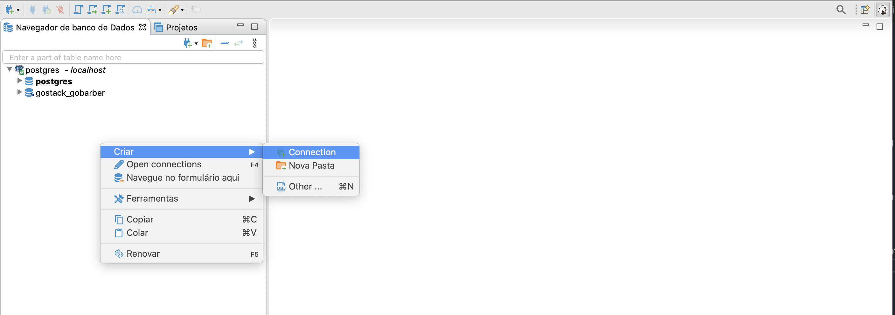
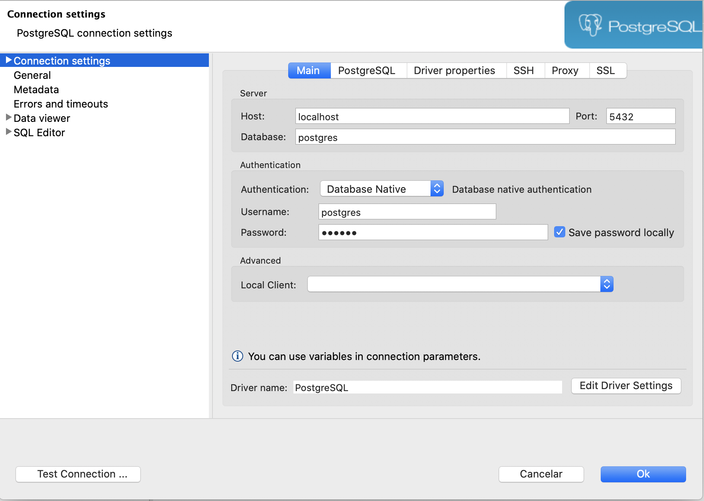
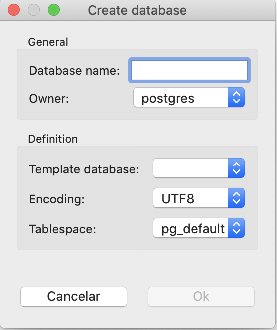

# DATABASE
## Docker config
- First of all, you must create a postgres database at docker using the CLI command above:
- If you don't have installed a postgres image, this command will install for you
- may take a few minutes to install, so go take a coffee  ☕️

```terminal
docker run --name <NAME TO FIND IN DOCKER> -e POSTGRES_PASSWORD=<YOUR AMAZING PASSWORD> -p 5432:5432 -d postgres
```

- after install, your image is running at port 5432 ( -p 5432:5432 means the external_port:container:port )
- if you already installed postgres without docker, this port should be in use, so choose another port (I really recommend to use 5433, 5435,..., change only the last number, this will make it easy to find later)

## DBEAVER
- To see all data inside your database, one option is to install DBEAVER in your computer ( there are more options, choose your favorite)
- create a new connection with postgres on dbeaver



- if you don't put an username, the default is [postgres]
- and the password is the amazing password you put on docker command



- After that, you must create a database:
  - Right click on your connection -> create -> database
  - put a database name, the enconding must be UTF-8 and keep others as default



## ORM Config
You must create a config file at the root level of your app, to configure the connections with database.

```javascript
{
  "type": "postgres",
  "host": "localhost",
  "port": 5432,
  "username": "postgres",
  "password": "<YOUR AMAZING PASSWORD>",
  "database": "gostack_gobarber",
  "entities": [
    "./src/models/*.ts"
  ],
  "migrations": [
    "./src/database/migrations/*.ts"
  ],
  "cli": {
    "migrationsDir": "./src/database/migrations"
  }
}
```

- Important Definitions:

  - entities:
    - the routes for your entities ( models inside your app )

  - migrations:
    - all files where the migrations are located
    - can be more than one,

  - cli: migrationDir
    - folder where your migrations files are
    - this is used to locate and run migrations.


# Migrations

Migrations are like a github for your database, it controls the version and state of your database.

## Migrations commands

To use migrations commands, go to your package.json and add a script like this:

```javascript
  "scripts": {
    "typeorm": "ts-node-dev ./node_modules/typeorm/cli.js"
  }
```

after that, use the following commands:

<strong>Show all migrations state</strong>

  - ``` yarn typeorm migration:show ```

<strong>Create migration</strong>

  - ``` yarn typeorm migration:create -n CreateAppointments ```

<strong>Run All Migration</strong>

  - ``` yarn typeorm migration:run ```

<strong>Revert last migration</strong>

  - ``` yarn typeorm migration:revert ```


# SQL Definitions

## Foreign Key

- Definition:
  - A FOREIGN KEY is a field (or collection of fields) in one table that refers to the PRIMARY KEY in another table.
  - The table containing the foreign key is called the child table,
  - The table containing the candidate key is called the referenced or parent table.

- Relations:
  - One to One
  - One to Many
  - Many to Many
